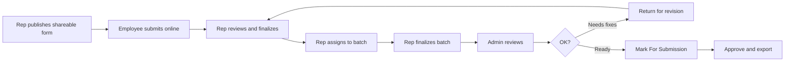

# PNPKI Submission Tracker — User Manual

Provincial Government of Davao del Sur

This guide explains how to use the **PNPKI Submission Tracker** to collect, review, and prepare employee applications for Philippine National Public Key Infrastructure (PNPKI) digital certificates.

---

## Table of contents

1. [Who this is for](#1-who-this-is-for)
2. [Getting started](#2-getting-started)
3. [Overall process at a glance](#3-overall-process-at-a-glance)
4. [For office representatives](#4-for-office-representatives)
5. [For employees (applicants)](#5-for-employees-applicants)
6. [For administrators](#6-for-administrators)
7. [Statuses explained](#7-statuses-explained)
8. [Revision and modification loops](#8-revision-and-modification-loops)
9. [Dashboard and notifications](#9-dashboard-and-notifications)
10. [Troubleshooting](#10-troubleshooting)

---

## 1. Who this is for

| Role | What you do |
|------|-------------|
| **Employee / applicant** | Fill out a public registration form using a link shared by your office. No account required. |
| **Representative** | Manage your office’s shareable form, review pending applications, group them into batches, and send finalized batches for admin review. |
| **Admin** | Review finalized batches, request corrections, mark applications ready for DICT submission, approve, and export files. |

---

## 2. Getting started

### Staff login (Admin & Representative)

1. Open the admin panel: [http://pnpki-tracker.test/admin/login](http://pnpki-tracker.test/admin/login)
2. Sign in with the email and password provided by your system administrator.
3. After login you land on the **Dashboard**.

Registration for new staff accounts is handled by an **Admin** under **Users** (self-registration is not available).

### Your profile

From the user menu, open **Profile** to update your name, email, password, or avatar.

### Navigation (staff)

| Menu item | Purpose |
|-----------|---------|
| **Dashboard** | Summary counts and recent registration chart |
| **Forms → Form Submissions** | Individual employee applications |
| **Forms → Shareable Forms** | Public registration links for your office |
| **Batches** | Groups of submissions for review and DICT packaging |
| **Offices** | Office records (admins manage all; reps see their own) |
| **Users** | Staff accounts (**Admin only**) |
| **Help** | In-app user guides (overview, role guides, statuses, troubleshooting) |

---

## 3. Overall process at a glance



**Typical happy path**

1. Representative creates an active **Shareable Form** and shares the public link.
2. Employees register through that link (documents + personal data).
3. Representative reviews each **Form Submission**, corrects if needed, and clicks **Finalize**.
4. Representative creates a **Batch**, assigns finalized submissions, then clicks **Finalize Batch**.
5. Admin reviews each submission, marks them **For Submission**, then marks the batch **For Submission**.
6. Admin **Approves**, then **Export CSV** and **Download Attachments** for DICT packaging.

---

## 4. For office representatives

### 4.1 Publish a shareable form

1. Go to **Forms → Shareable Forms**.
2. Click **New Shareable Form** (you can have only one active form per office; creating a new one deactivates older ones).
3. The form name is set from your office name. Save.
4. Open the form and use **Copy Public Link**.
5. Share the link with employees (email, chat, QR code, etc.).

Public link format: `http://pnpki-tracker.test/p/forms/{public-id}`

Only an **active** form accepts new registrations. If employees report that the link no longer works, check that your shareable form is still active.

### 4.2 Review pending submissions

1. Go to **Forms → Form Submissions**.
2. The navigation badge shows your **pending** count.
3. Open a pending record. Check personal details, address, employment info, TIN, and uploaded PDFs.
4. Edit anything that is incorrect or incomplete.
5. Click **Finalize** when the record is ready.

**Notes**

- You only see submissions for **your office**.
- You can **Revert to pending** later if the submission is not locked inside a finalized batch.
- Admins may also create a submission manually for an office; you will get a notification when that happens.

### 4.3 Assign submissions to a batch

1. Open a finalized (or needs-revision / for-submission) submission.
2. Use **Assign to Batch** and select a batch from your office.
3. To remove it later (while the batch is not finalized), use **Remove from Batch**.

Representatives can assign only submissions that are not already in a batch.

### 4.4 Create and finalize a batch

1. Go to **Batches** → create a new batch.
2. The system names it automatically using your office acronym (for example `PHRMO-1`).
3. Assign finalized submissions to the batch.
4. When the group is complete, open the batch and click **Finalize Batch**.

**Finalize Batch requirements**

- The batch must have at least one submission.
- No submission in the batch may be in **Needs Revision**.

After finalize:

- Batch status becomes **Finalized**.
- Application status becomes **Pending for Review**.
- All Admins are notified.

### 4.5 Request modification after admin review starts

If you spot issues after your batch was finalized (and before the batch is marked **For Submission**):

1. Open each problem submission and click **Flag Needs Revision** (remarks required).
2. On the batch page, click **Request Modification**.
3. Wait for an Admin to **Accept Modification Request**.
4. When the batch returns to **Needs Revision**, edit the flagged submissions, **Finalize** them again, then **Finalize Batch** again.

---

## 5. For employees (applicants)

You do **not** need an account. Use only the link your office representative sends you.

### 5.1 Registration wizard steps

| Step | What you provide |
|------|------------------|
| **1. Documents** | Privacy consent, ID combination, PDF uploads |
| **2. Personal** | Name, sex, civil status, birth details (maiden name if female and married) |
| **3. Address & contact** | House/street, province, city/municipality, barangay, ZIP, email, phone |
| **4. Employment** | Organization (pre-filled), organizational unit, TIN |
| **5. Review & submit** | CAPTCHA check, then submit |

### 5.2 Document rules

- All uploads must be **PDF**, maximum **5 MB** each.
- Always upload the **PNPKI form** plus the IDs required by your chosen combination.
- If an ID has a back side, include both sides in the PDF when possible.

**Accepted ID combinations**

| Combination | Required uploads |
|-------------|------------------|
| PNPKI form + PhilID | PNPKI form, Philippine National ID |
| PNPKI form + Passport | PNPKI form, Passport |
| PNPKI form + UMID | PNPKI form, UMID |
| PNPKI form + Driver’s License | PNPKI form, LTO Driver’s License |
| PNPKI form + PRC | PNPKI form, PRC ID |
| PNPKI form + Postal ID | PNPKI form, Postal ID |
| PNPKI form + Birth Cert & UMID | PNPKI form, Birth Certificate, UMID |
| PNPKI form + Passport & UMID | PNPKI form, Passport, UMID |
| PNPKI form + Birth Cert & 2 Valid IDs | PNPKI form, Birth Certificate, Valid ID #1, Valid ID #2 |
| PNPKI form + Passport & 2 Valid IDs | PNPKI form, Passport, Valid ID #1, Valid ID #2 |

### 5.3 Field tips

- **Phone:** Philippine mobile format, e.g. `09171234567`.
- **TIN:** 9 digits; must be unique in the system.
- **ZIP code:** 4 digits.
- **Address:** Use the province → city/municipality → barangay selectors (Philippine standard geographic codes).

### 5.4 After you submit

- You receive a confirmation screen and a **reference number** (for example `PNPKI-2026-0000001`).
- You can download a **PDF receipt** from the success page. The download link is temporary (about 5 minutes)—save it promptly.
- Your office representative is notified automatically and will review your application.
- You cannot submit again with the same **first name + date of birth** for that office (duplicate protection).

---

## 6. For administrators

### 6.1 What you see

- **Form Submissions:** primarily records that are already **Finalized**, **Needs Revision**, or **For Submission** (across offices).
- **Batches:** all offices, with list tabs such as **Pending**, **Needs Revision**, **For Submission**, and **Approved Submissions**.
- **Offices** and **Users:** full create / update / delete.

### 6.2 Review a finalized batch

1. Open **Batches** and select a batch with application status **Pending for Review**.
2. Open each submission. Verify data and attachments.
3. For each ready submission, click **Mark as For Submission**.
4. When every submission in the batch is **For Submission** (and none are flagged), click **Mark as For Submission** on the batch.
5. Click **Approve Submission** when the package is accepted.
6. Use **Export CSV** and **Download Attachments** (ZIP) while the batch is **For Submission**.

### 6.3 Return a batch for revision

If corrections are needed:

1. Open each problematic submission and click **Flag Needs Revision** (enter remarks).
2. On the batch, click **Return Batch for Revision**.
3. The representative is notified and can edit flagged records.

### 6.4 Accept a representative’s modification request

When a representative has flagged items and clicked **Request Modification**:

1. Open the batch (application status **Modification Requested**).
2. Click **Accept Modification Request**.
3. The batch moves to **Needs Revision** for the representative to fix.

### 6.5 Other admin actions

| Action | When to use |
|--------|-------------|
| **Revert to Pending** (batch) | Undo finalize and clear application status so the batch can be rebuilt |
| **Create Form Submission** | Encode an application manually for an office |
| Manage **Offices** / **Users** | Maintain office records and staff accounts |

Export and ZIP download are available when the batch application status is **For Submission**.

---

## 7. Statuses explained

### Submission status (each employee application)

| Status | Meaning |
|--------|---------|
| **Pending** | Newly submitted or reverted; representative can edit |
| **Finalized** | Representative accepted the data locally |
| **Needs Revision** | Flagged for corrections |
| **For Submission** | Cleared by admin for the DICT package |

### Batch status

| Status | Meaning |
|--------|---------|
| **Pending** | Still being assembled by the representative |
| **Finalized** | Sent to admin for review |
| **Needs Revision** | Returned for representative corrections |

### Application status (on the batch, after it is finalized)

| Status | Meaning |
|--------|---------|
| **Pending for Review** | Waiting for admin review |
| **Modification Requested** | Representative asked to reopen after flagging issues |
| **Needs Revision** | Admin returned the batch for fixes |
| **For Submission** | Ready for export / DICT packaging |
| **Approved Submission** | Admin approved the package |

---

## 8. Revision and modification loops

### Path A — Admin finds problems

```
Finalized batch (Pending for Review)
  → Admin flags submissions
  → Return Batch for Revision
  → Rep edits & re-finalizes submissions
  → Rep finalizes batch again
  → Admin review continues
```

### Path B — Representative finds problems after finalize

```
Finalized batch (Pending for Review)
  → Rep flags submissions
  → Request Modification
  → Admin Accept Modification Request
  → Rep edits & re-finalizes
  → Rep finalizes batch again
  → Admin review continues
```

Flagging always requires **remarks** so the other party knows what to fix.

---

## 9. Dashboard and notifications

### Dashboard widgets

- Counts for submissions, batches, shareable forms, users, offices, and employee headcount
- Chart of form submissions over the last 30 days

### In-app notifications (bell icon)

Staff receive database notifications such as:

| Event | Who is notified |
|-------|-----------------|
| New public (or manual) submission | Form owner / office representatives |
| Batch finalized | All admins |
| Modification requested | All admins |
| Batch returned / needs revision | The batch’s representative |

There is no separate email flow for these events in the current system—check the notification bell while logged in.

---

## 10. Troubleshooting

| Problem | What to try |
|---------|-------------|
| Public form link does not load or rejects submissions | Confirm the shareable form is **active**. Creating a new form deactivates older links. |
| “Duplicate” / cannot submit | Someone with the same first name and birth date already submitted for that office. Contact your representative. |
| CAPTCHA / submit fails | Complete the security check again; refresh if the page sat open a long time. |
| Cannot finalize a batch | Ensure at least one submission is assigned and none are **Needs Revision**. |
| Cannot mark batch For Submission | Every submission in the batch must already be **For Submission**, with no active flags. |
| Cannot export CSV or ZIP | Batch application status must be **For Submission**. |
| Receipt PDF link expired | The signed receipt link lasts about 5 minutes after submit. Ask your representative for your reference number if needed. |
| PDF autofill looks incomplete | Autofill from the PNPKI PDF is best-effort. Always review every field before submitting. |
| Forgot password | Ask an Admin to reset your account (self-serve password reset is not available on the login screen). |

---

## Quick role checklist

### Representative

- [ ] Active shareable form published and link shared  
- [ ] Pending submissions reviewed and finalized  
- [ ] Submissions assigned to a batch  
- [ ] Batch finalized for admin review  
- [ ] Respond to any **Needs Revision** flags promptly  

### Admin

- [ ] Review each submission in finalized batches  
- [ ] Mark submissions (then the batch) **For Submission**  
- [ ] Approve when ready  
- [ ] Export CSV and download attachment ZIP  
- [ ] Return batches for revision when data or documents are incomplete  

### Employee

- [ ] Use the official link from your office  
- [ ] Choose the correct ID combination and upload clear PDFs  
- [ ] Complete all wizard steps and save your reference number / receipt  

---

*Document version: based on the application behavior as of July 2026. For deployment or technical setup, see the project deployment guides—not this manual.*
